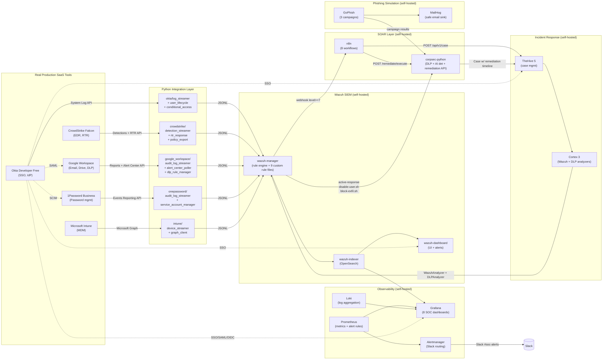
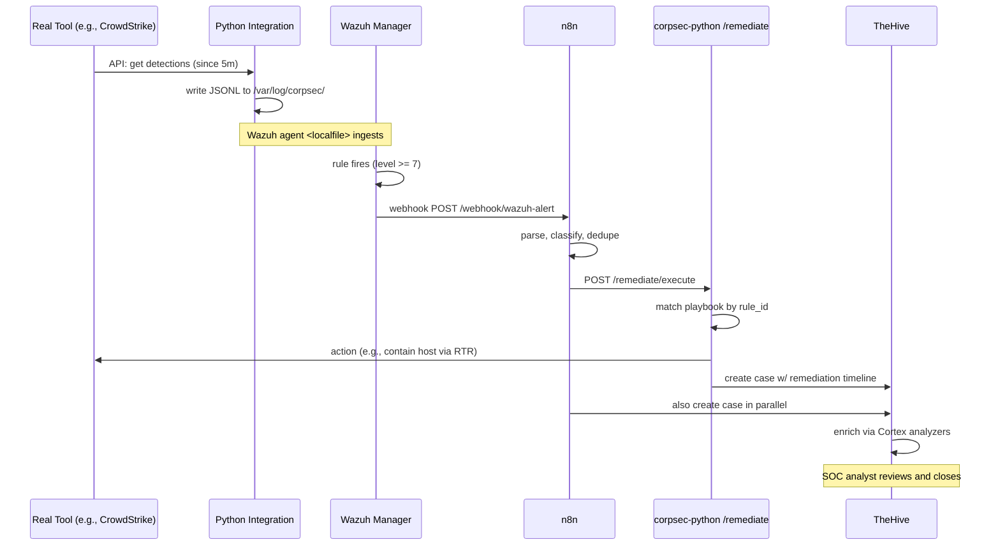

# Architecture Diagram — Mermaid Source

Render this diagram with any Mermaid-compatible tool:
- GitHub renders it automatically in `.md` files
- VS Code: Mermaid Markdown preview extension
- mermaid.live: paste the source into the live editor for PNG export → save to `screenshots/architecture/arch-diagram.png`

## Full Stack Diagram



## Simplified Data Flow



## How to Export to PNG

```bash
# Option 1: mermaid-cli
npm install -g @mermaid-js/mermaid-cli
mmdc -i docs/architecture-diagram.md -o screenshots/architecture/arch-diagram.png

# Option 2: paste each diagram block into mermaid.live and download PNG
# Option 3: GitHub-rendered diagram → screenshot the rendered page
```
